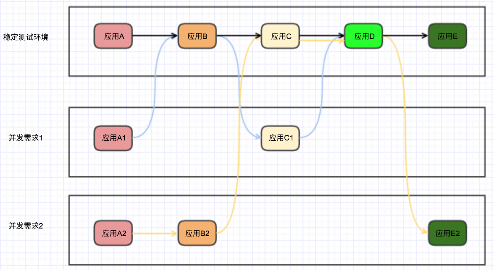

1. dubboFeatrue解决了什么问题?      
    在微服务架构中经常会有多个feature并行开发测试的情况，为了使多个feature之间不相互影响一般需要部署多套环境。这样在服务比较少并行开发
的feature也比较少的情况下是可行的。但是如果服务比较多或者并行开发的feature这种方法成本太高了，一个项目组有几十个微服务且经常是多个feature并行开发是很常见的，
如果每个feature都部署一套测试环境也太浪费资源了。dubboFeature可以在`不修改代码`的前提下解决该问题。     
     一图顶千言，最终要实现的效果建下图:     
      
1. 支持jdk1.6+
1. 理论上只需要依赖dubbo和spring(用到了spring的BeanFactoryPostProcessor)
1. 用router不合适，因为实现feature的传递的如果某个稳定测试环境的服务B需要调用C就需要判断应该调用哪个feature然后再修改路由规则，修改完路由规则后再调用相应的C服务
这种实现方案有线程安全问题，比如当feature1中的调用链路修改完路由规则准备调用C1前，feature2中的调用链路修改了路由规则，这是两个feature的调用链路都会调用
到C2.
1. 用负载均衡：实现一个负载均衡，覆盖当前的负载均衡策略，因为负载均衡策略一般不会在测试环境测试，所以跟修改路由规则的实现方案相比简单很多。但是当只有一个提供者
时不会走负载均衡的逻辑所以需要修改dubbo的源代码使其即使只有一个提供者也要走负载均衡逻辑，但是修改源代码有很多弊端，比如:生产和测试需要依赖不同的jar,dubbo升级
需要重新修改代码打包。为了避免这些弊端所以用选择了自己实现一个javaagent(在feature-agent的根目录下mvn clean package即可)。
1. 服务部署      
不用修改任何代码将dubboFeature打包，并添加到微服务的依赖。    
启动命令中增加以下参数      
    ``` 
    -Ddubbo.registry.address=zkExt://127.0.0.1:2181（注册协议和zk地址）
    -D_feature=testFeature(feature名称)
    -Ddubbo.protocol.name=dubbo(根据实际情况设置) 
    -Ddubbo.protocol.port=20102(根据实际情况设置) 
    -javaagent:/xxx/feature-agent-1.0-SNAPSHOT-jar-with-dependencies.jar
    ```
1. todo 
    1. 由于ThreadLocal的特性，多线程的时候就无法实现feature传递。考虑过InheritableThreadLocal但是InheritableThreadLocal只有在
   父子线程间能传递好像只能传递new子线程的时候已经存在的InheritableThreadLocal。所以考虑自己实现的Callable、Runnable的抽象子类和线程池[参考](https://zhuanlan.zhihu.com/p/25243399)。
